# School_District_Analysis

## Overview of the school district analysis:
The school board has notified Maria and her supervisor that the students_complete.csv file shows evidence of academic dishonesty; specifically, reading and math grades for Thomas High School ninth graders appear to have been altered. Maria has turned to us for help and has asked us to replace the math and reading scores for Thomas High School with NaNs while keeping the rest of the data intact. Once the math and reading scores are replaced, we will repeat the school district analysis and write up a report to describe how these changes affected the overall analysis.

## Results:
### The math and reading scores of all the ninth grade students from Thomas High have been replaced with NaNs.

### How is the district summary affected?
#### We ran the district analysis. Replacing Thomas High's scores with NaNs did not affect the disctrict analysis. Maybe just a 1/10th of a percent high or low than before the replacement.

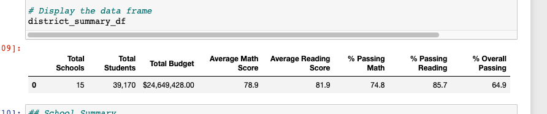

### How is the school summary affected?
#### The per school summary for Thomas High's scores have changed (reduced) because the math and reading scores for ninth grade are now NaNs.

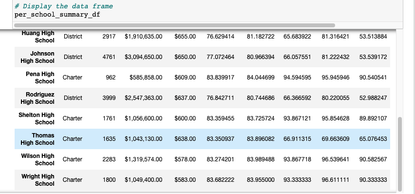 

### How does replacing the ninth graders’ math and reading scores affect Thomas High School’s performance relative to the other schools?
#### Thomas High school is no longer in the top five schools after we replace the ninth grade scores to NaNs.

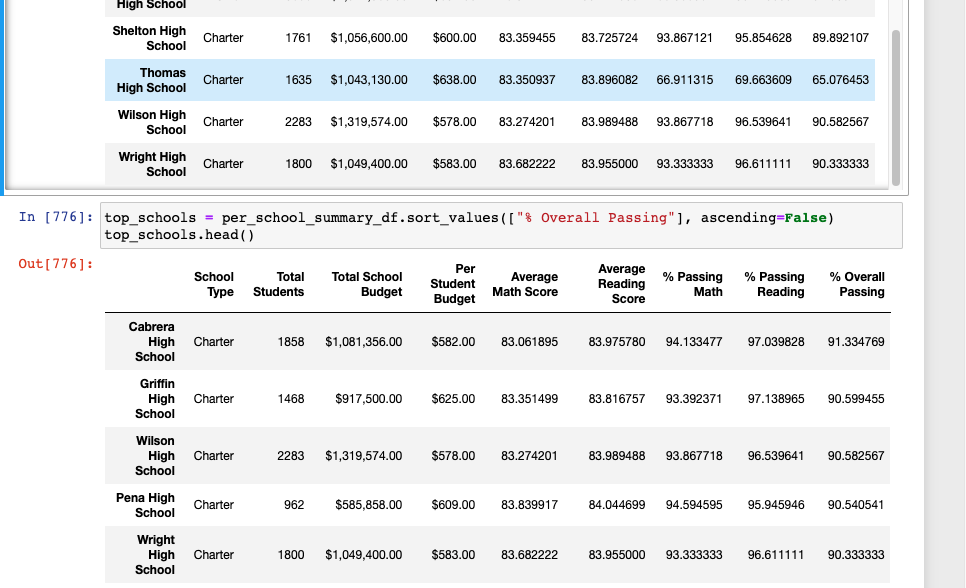

### How does replacing the ninth-grade scores affect the following:

### Math and reading scores by grade
#### Both average math and reading scores by grade were unchanged for all grades except 9th grade was NaNs

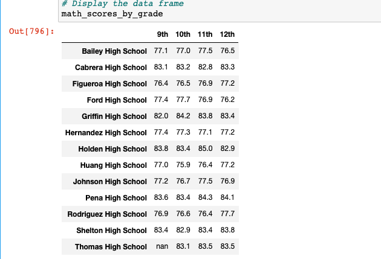

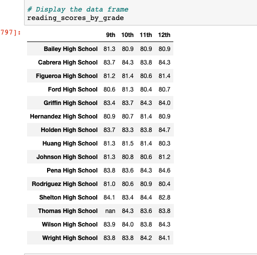

### Scores by school spending
#### Results unchaged

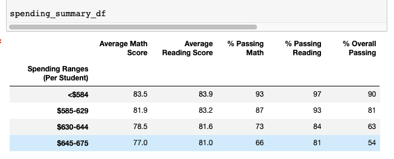

### Scores by school size
#### Results unchaged

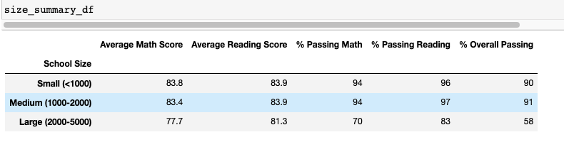

### Scores by school type
#### Results unchanged

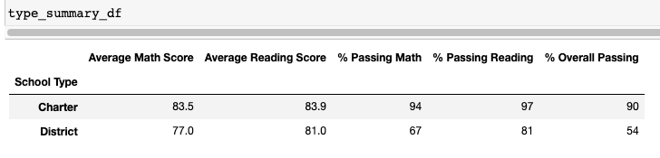

## Replacing math & reading scores to include only 10th to 12th grade
### We now replaced the math and reading scores to include 10th to 12th grade scores only and recalculated the per-school summary.

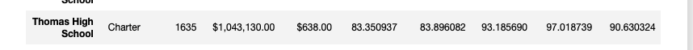

### We then ran a script to find the top 5 schools in the district after replacing with only 10th to 12th grade scores. Thomas High position now changed to becoming second in the top five schools.

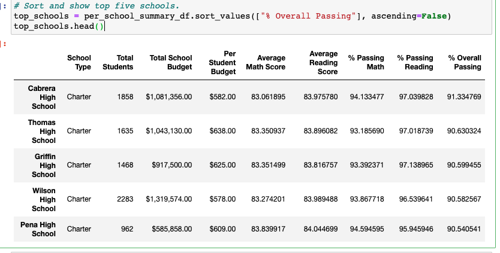

### We also ran a script to find the bottom five schools

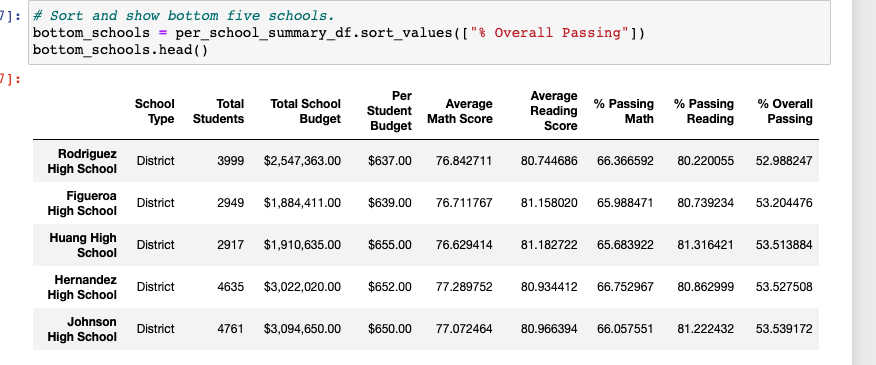

## Summary: Summarize four changes in the updated school district analysis after reading and math scores for the ninth grade at Thomas High School have been replaced with NaNs.

### -  The per school summary for Thomas High's scores have changed (reduced) because the math and reading scores for ninth grade are now NaNs.
### - Thomas High was removed from the top five after NaNs were introduced for ninth grade scores.
### - Thomas High once again became second in the top five school list when only 10 to 12 th grade score summaries were performed.
### - Summary based on spending, school size and type remain unchaged even after replacing 9th grade scores with NaNs

